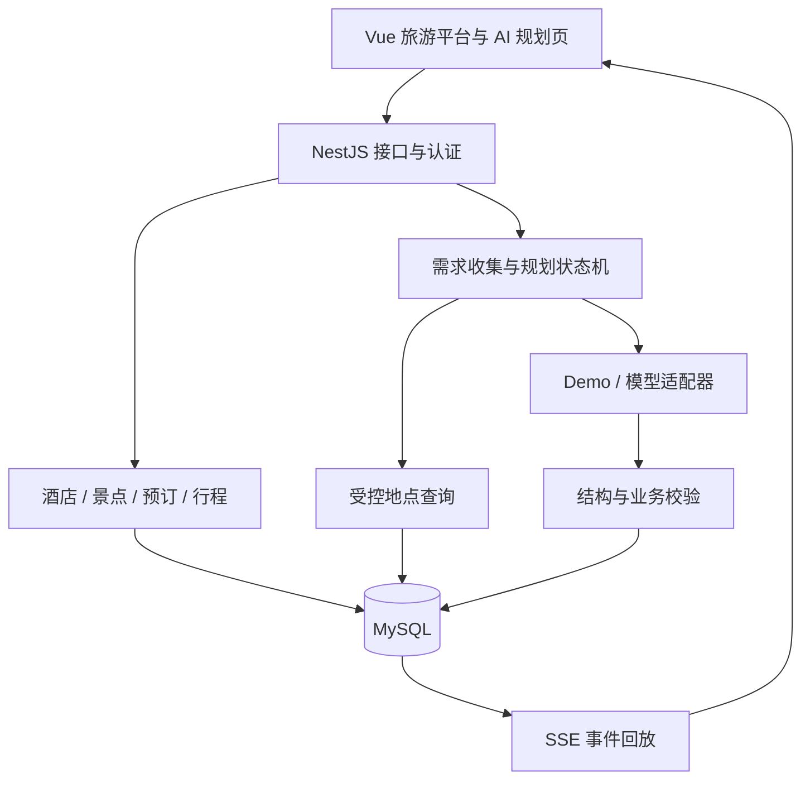

# 上海旅游平台 Node.js 迁移方案

制定日期：2026-09-20。状态：方案已制定，迁移尚未执行。

目标：以 `my-project` 为主项目，将 Spring Boot 业务后端和 FastAPI 行程规划后端逐步统一为 Node.js，复用现有 Vue 页面，最终形成“登录 → 浏览地点 → AI 生成 → 编辑 → 保存个人行程”的完整流程。

本次只新增方案文档。以下新增目录、接口和数据库字段均为计划，不代表已实现。

## 1. 迁移范围与里程碑

### 最终交付

- 一个 Vue 3 前端：保留酒店、景点、个人中心、预订、手动行程和管理员页面，加入 `/agent` 规划页。
- 一个 NestJS 后端：处理业务接口、身份认证、AI 会话、模型调用、SSE 和行程保存。
- 一个 MySQL 业务数据库：统一用户、地点、个人行程与新增 AI 会话数据。
- Demo 模式无密钥即可演示；保留真实模型适配器，模型密钥只在服务端使用。
- 可重复执行的迁移、测试、启动说明，以及已演练的切换和回退流程。

| 里程碑 | 完成阶段 | 可以实际演示什么 |
| --- | --- | --- |
| M1：Node 接通页面 | 0–3 | 旧账号登录、酒店搜索、酒店与景点详情 |
| M2：业务迁移完成 | 4 | 收藏、历史、预订、行程编辑、管理员维护景点 |
| M3：AI 整合完成 | 5–6 | 登录用户追问补充需求、查看生成进度、取消或恢复、保存并编辑 AI 行程 |
| M4：默认使用 Node | 7 | 新环境按文档启动，业务和 AI 全流程通过验收 |

此次迁移保持现有产品范围：预订仍是演示记录，地图仍是坐标示意图。真实支付、房态库存、地图导航、RAG、向量库、多 Agent、Redis 和分布式队列不列入本轮交付。

## 2. 技术选型与目录

| 部分 | 方案 | 说明 |
| --- | --- | --- |
| 运行时 | Node.js 24 LTS | 执行阶段锁定受支持的具体补丁版本 |
| 后端 | NestJS 11 + TypeScript 5.9 | 按功能拆 Module、Controller、Service；初版单进程运行 |
| HTTP 平台 | Nest 默认 Express 5 | 校验查询参数与路由匹配，不自行切换 HTTP 平台 |
| 数据访问 | Prisma 7 + MySQL 驱动适配器 | 保留原表名、关系和约束；Prisma CLI 与 Client 锁定同一补丁版本 |
| 数据库 | MySQL | 先核实本机版本、SQL mode、字符集，再固定测试环境版本 |
| 认证 | JWT + BCrypt | 保持原账号和接口契约；AI 使用同一账号体系 |
| 参数校验 | DTO 类 + ValidationPipe | 对 HTTP 输入执行运行时校验 |
| AI 结果校验 | Zod schema + 独立业务校验器 | 分别检查 JSON 结构、地点、时间与预算 |
| 推送 | SSE + 数据库事件记录 | 支持事件编号、去重、回放和重新签发流式凭证 |
| 测试 | 后端 Jest / Supertest；前端 Vitest；关键流程 Playwright | 后端编译配置沿用 Nest 11 模板，避免测试工具丢失装饰器元数据 |

这是依据官方要求选择的兼容基线，不是已经安装验证的依赖组合。阶段 0、2 必须完成依赖解析、编译和真实 MySQL 冒烟检查。现有两个前端的 TypeScript 版本不同，初期保持各自依赖独立，不同时升级前端工具链。

建议目录：

```text
my-project/
├─ src/                         # 主前端，继续使用现有 Vue 结构
│  ├─ api/agent.ts               # 从 AI 项目接入并增加真实认证
│  ├─ components/agent/
│  ├─ composables/useAgentStream.ts
│  ├─ stores/planning.ts
│  └─ views/agent-planner.vue
├─ server/                      # 新增 NestJS，独立 package.json / lockfile
│  ├─ prisma/                   # schema、已审核迁移、演示 seed
│  ├─ prisma.config.ts
│  ├─ src/
│  │  ├─ common/                # 错误响应、鉴权、时钟、序列化
│  │  ├─ database/
│  │  ├─ auth/
│  │  ├─ users/
│  │  ├─ hotels/
│  │  ├─ pois/
│  │  ├─ favorites/
│  │  ├─ history/
│  │  ├─ bookings/
│  │  ├─ itineraries/
│  │  └─ agent/                 # 会话、任务、事件、模型适配、校验
│  └─ test/
├─ plans/nodejs-migration.md     # 本方案，不能放在构建产物 docs/ 内
├─ travel-backend/               # 迁移期间保留，用于对照与回退
└─ docs/                        # 现有 Vite 输出目录

travel-agent-python/            # 迁移期间保留，提供源代码与测试用例
```

`my-project` 自身有 Git 仓库，外层仓库把它记录为 gitlink；`travel-agent-python` 也有独立仓库。实施时在正确仓库记录变更，不能认为外层一次提交就包含了两套项目的源码。



## 3. 已核实的现状与迁移约定

### 3.1 接口兼容矩阵

以下路径均带 `/api` 前缀。迁移先保持 HTTP 方法、字段、状态码和响应结构，避免同时大改前端。

| 模块 | 现有接口 | 必须保留的行为 |
| --- | --- | --- |
| 用户 | `POST /users/register`、`POST /users/login`、`GET /users/me` | 注册默认 USER，JWT 登录，返回 `accessToken/tokenType/expiresAt/user` |
| 酒店 | `GET /hotels`、`/hotels/recommended`、`/hotels/search`、`/hotels/:id` | 匿名读取；搜索 query 与数组结果保持兼容，详情包含房型与点评 |
| 景点等地点 | `GET /pois`、`GET /pois/:id` | 公开接口只显示启用地点，分页从 0 开始 |
| 管理员地点 | `GET/POST /admin/pois`、`PUT/DELETE /admin/pois/:id` | ADMIN 授权；PUT 使用请求体 `version`；DELETE 使用 `If-Match`，执行软下架 |
| 收藏 | `GET/POST/DELETE /favorites`、`GET /favorites/check` | 删除和检查用 query `hotelId`；已收藏再次添加返回冲突 |
| 历史 | `GET/POST/DELETE /history` | 每用户同酒店保留最新记录、最多 20 条；`visitedAt` 为毫秒时间戳 |
| 预订 | `POST/GET /bookings`、`GET /bookings/:id`、`POST /bookings/:id/cancel` | 创建需要 `Idempotency-Key`；取消需要 `If-Match`；数据归属检查 |
| 行程 | `GET/POST /itineraries`、`GET/PUT/DELETE /itineraries/:id` | 日期范围、用户归属、版本校验 |
| 行程项目 | `POST /itineraries/:id/items`、`PUT/DELETE /itineraries/:id/items/:itemId` | 修改父行程版本，校验项目日期及地点类型 |
| AI 会话 | `POST /agent/sessions`、`GET /agent/sessions/:id`、`POST .../answers`、`POST .../cancel` | 保持现有 snake_case JSON；增加真实用户认证与归属校验 |
| AI 推送 | `GET /agent/sessions/:id/events` | 命名事件、事件编号、心跳、回放、短期 stream token |

特别注意：README 对管理员 POI 更新的版本头描述不准确。实际 `AdminPoiController.update` 与 `src/api/pois.ts` 使用请求体 `version`，以实际代码和契约测试为准。

业务响应沿用 `{ code, message, data, traceId, timestamp }`。AI 路由暂时保留原裸 JSON 与 `{ detail }` 错误响应，前端通过专门 API 模块接入；SSE 不套统一响应包装。后续若统一响应格式，单独作为契约变更处理。

### 3.2 需要跨语言保留的规则

- **账号**：BCrypt 哈希直接迁移并以测试账号验证互认；禁止改成明文密码或前端模拟登录。JWT 使用 HS256、原 issuer `shanghai-travel-backend`、正整数字符串 `sub`、必需的 `exp` 与角色声明。迁移期按需保留相同签名配置，并用旧新后端互认测试验证，不能仅解码不验签。
- **金额**：内部使用 Decimal 或整数分计算，接口按现有 DTO 输出 JSON number。不能让 Prisma Decimal 自动变成字符串导致 Vue 显示或计算异常。
- **ID**：MySQL BIGINT 在 Node 内可能为 bigint。接口维持现有 number 前，核对所有值处于安全整数范围；越界时明确阻止切换并制定字符串 ID 契约，禁止静默转换丢精度。
- **日期**：预订与行程的 DATE 保持 `YYYY-MM-DD`，TIME 保持接口原格式；“今天”按上海时区判断。不要把日期直接经过 UTC 转换后造成前后一天偏移。DATETIME(6) 的历史含义需用旧接口样本核对，不能假设均为 UTC。
- **预订**：服务端按酒店展示价 × 晚数固化金额；房型只是展示，不新增房型订单。入住须晚于今天，离店晚于入住，人数 1–10。同用户同幂等键同内容重放，不同内容返回 409；取消重复执行仍保持取消状态。
- **行程**：首版最多 31 天；项目日期必须落在行程内，起止时间同时提供或同时留空；当前手动行程没有跨项目时间冲突校验，不能声称迁移后自然具备此能力。
- **版本**：必须在数据库条件更新中同时比较 `id + userId + version` 并递增版本。父行程和项目写入在同一事务，不能“先查版本、随后无条件更新”。
- **地点软下架**：不删除被引用的地点；已有行程保留关联并返回 `poiActive=false`。新建关联只能选择有效地点。
- **AI**：状态、问题顺序、候选地点限制、团队费用、事件序号及终态一致性都属于必须保留的行为，不能只迁移模型请求代码。

### 3.3 本轮明确修复和新增的行为

这些属于有意改进，不要求复制旧缺陷；用新测试说明差异。

1. 修复正则把“12天、21人”截成“2天、1人”的问题；完整读取数字再校验，超范围给出明确提示。人数未提供仍先按现有规则默认 1，并在需求摘要中显示。
2. AI 的创建、详情、回答、取消、续签凭证、保存接口统一检查用户；用户 A 不能访问用户 B 的会话。
3. 增加流式凭证续签与刷新恢复，解决生成中刷新只能重新规划的问题。
4. 增加 AI 行程保存到“我的行程”；重复保存同一次运行返回同一行程。
5. 修复主前端管理员页面的隐式 any，接入类型检查；搜索加入取消/序号防护，酒店详情区分网络失败与 404。
6. 给真实模型入口增加基本频率和并发限制，错误脱敏，避免反复点击无限启动任务。

## 4. 阶段 0：文档发现与版本确认

**前置条件**：无。只读文档调查已完成；安装、编译与数据库验证留待执行阶段。

**要做的事**：按下面官方示例确定实现模式，将具体包版本、模块格式、MySQL 版本写入执行记录。后端初始采用独立 CommonJS 编译配置，Prisma 生成客户端采用 `moduleFormat = "cjs"`；不继承前端 `type: module` 的配置。

| 文档编号 | 官方来源与示例位置 | 允许使用的 API / 模式 |
| --- | --- | --- |
| D1 | [Node 版本状态](https://nodejs.org/en/about/previous-releases)、[Nest 11 迁移说明](https://docs.nestjs.com/v11/migration-guide) | Node 24 LTS；Nest 11 的 Express 5 与运行时要求 |
| D2 | [Nest 11 Modules](https://docs.nestjs.com/v11/modules)、[Providers](https://docs.nestjs.com/v11/providers)、[Controllers](https://docs.nestjs.com/v11/controllers) | `@Module`、`@Injectable`、Controller/Service 分层及依赖注入 |
| D3 | [Nest 11 Validation](https://docs.nestjs.com/v11/techniques/validation)、[Authentication](https://docs.nestjs.com/v11/security/authentication) | DTO 类、`ValidationPipe`、`JwtService.signAsync/verifyAsync`、认证守卫 |
| D4 | [Nest 11 SSE](https://docs.nestjs.com/v11/techniques/server-sent-events) | `@Sse`、`Observable<MessageEvent>`、事件 `id/type/data`、订阅清理 |
| D5 | [Prisma 7 升级指南](https://docs.prisma.io/docs/guides/upgrade-prisma-orm/v7)、[Nest Prisma 示例](https://docs.nestjs.com/recipes/prisma)的模块格式章节 | `prisma.config.ts`、显式加载环境变量、`prisma-client` 生成器与 CJS 配置；只取 Prisma 7 相关示例 |
| D6 | [Prisma 接入现有 MySQL](https://docs.prisma.io/docs/prisma-orm/add-to-existing-project/mysql)、[MySQL 7 版连接器](https://docs.prisma.io/docs/orm/v7/core-concepts/supported-databases/mysql) | `PrismaMariaDb`、`new PrismaClient({ adapter })`、反向读取表结构 |
| D7 | [Prisma 7 Baselining](https://docs.prisma.io/docs/orm/v7/prisma-migrate/workflows/baselining)、[migrate diff](https://docs.prisma.io/docs/cli/v7/migrate/diff) | `db pull`、`migrate diff`、`migrate resolve --applied`、`--output` |
| D8 | [Prisma 7 Transactions](https://docs.prisma.io/docs/orm/v7/prisma-client/queries/transactions) 的 Interactive transactions / OCC / Idempotent APIs 章节 | `$transaction`、`updateMany` 条件更新、唯一约束、P2034 有限重试 |
| D9 | [Nest 11 Testing](https://docs.nestjs.com/v11/fundamentals/testing) | `Test.createTestingModule`、Supertest HTTP 验证 |

**验收**：记录每项依赖确切补丁版本；生成客户端、后端 TypeScript 编译、数据库连接可以通过；示例涉及的方法与当前锁定版本一致。

**约束**：不直接安装无版本的 latest CLI；Nest 默认文档已出现新大版本，不能混入新版专用 API。Prisma 7 与新版 Prisma 的迁移命令也不能混用。文档要求与实际依赖冲突时先调整版本记录，不能凭印象编造 API。

## 5. 阶段 1：保存基线、提取契约和建立数据库副本

**前置条件**：阶段 0 的版本方向已确认。

**实施内容**：

1. 在两套实际仓库分别记录当前工作区状态。现有大量未提交改动要先保存为可恢复的快照；仅创建分支不能保存未提交内容，不执行清理或重置工作区。
2. 从上面的接口表和旧 Controller/DTO 导出请求响应样本，包括成功、参数错误、未登录、越权、重复请求、版本冲突。动态时间与 token 在比较时做受控归一化，不能忽略业务字段。
3. 核对本机 MySQL 与现有表结构、Flyway 历史，导出备份并验证可恢复。创建独立迁移库与集成测试库，测试不连接开发主库。
4. 保存 SQLite 演示会话库副本及原 POI JSON；旧匿名会话无法证明账号归属，默认归档，不自动认领到任何用户。正式新会话写 MySQL。
5. 将旧测试转成场景清单，区分已测与尚未测。此前本会话结果为 Java 61 通过/2 因 Docker 跳过，Python 47 通过，前端单 worker 10 通过；这是迁移前参照，不是 Node 的测试成绩。

**参考**：现有 `travel-backend/src/main/java/com/shanghai/travelbackend/controller/`、`dto/`、`src/api/`；D7、D9。

**验收**：备份恢复成功；所有现有接口都有契约条目；越权和并发场景有测试输入；执行记录标明真实 MySQL 集成尚缺什么环境。

**约束**：不把 README 代替接口事实；不把被跳过的 MySQL 测试计为通过；不在外层 Git 仓库误提交整个已有工作区。

## 6. 阶段 2：NestJS 基础工程与数据库接入

**前置条件**：阶段 1 数据库副本与契约清单可用。

**实施内容**：

1. 按 D2 的 Controller/Provider/Module 示例建立 `server/`，先实现健康检查、配置、日志、统一异常和校验。健康检查区分进程存活与数据库就绪。
2. 按 D6 的 MySQL 示例建立数据库 provider；CLI 和应用连接必须指向同一个预期库。通过环境变量注入配置，输出日志只显示数据库别名，不打印连接串或密码。
3. 在副本上反向读取表结构，使用 Prisma 映射保留原表名/列名、索引、外键和大小写比较行为。Flyway 历史保留，避免被新 ORM 当作业务实体管理。
4. 按 D7 建立原业务表的迁移基线。对照 V1–V5 审核 introspection 不能完整表达的 CHECK 等约束，把必要 SQL 纳入基线；用 `SHOW CREATE TABLE` 比较副本与新建空库。
5. 后续新字段统一由 Prisma 迁移管理。已有库仅标记已存在的基线；空库实际执行基线。演示数据使用独立、可重复执行的 seed，不能靠启动清表实现初始化。
6. 建立 DTO 映射与时间工具，测试 BIGINT、DECIMAL、BIT、DATE、TIME、DATETIME 和 null 的 JSON 行为；为测试注入可控时钟。

基线命令仅供执行阶段参考，在审核后的副本中使用，并由项目本地锁定的 Prisma 7 CLI 执行：

```text
prisma db pull
prisma migrate diff --from-empty --to-schema prisma/schema.prisma --script --output prisma/migrations/0_init/migration.sql
prisma migrate resolve --applied 0_init
prisma generate
```

生成 SQL 与标记已应用是两个独立步骤：前者必须审阅，后者只适用于已具有这些表结构的数据库。Prisma 7 的生成客户端与 seed 分别显式执行。

**验收**：新空库能初始化；已有副本接入前后原业务表数据不变；约束清单一致；类型检查、启动、数据库读写与 JSON 冒烟测试通过。

**约束**：不对原数据库执行 `migrate reset`、破坏性 `db push`；不同时让 Hibernate/Flyway 与 Prisma 管理新结构；不因 introspection 未展示约束就删除它。

## 7. 阶段 3：账号与公开查询——完成 M1

**前置条件**：阶段 2 通过。

**实施内容**：

1. 参考 D3 的 JWT 与 DTO 示例实现登录、注册、资料、认证守卫和 ADMIN 守卫；结合原 Java `JwtConfig`、`JwtTokenService` 与 `SecurityConfig` 复制业务约束。
2. 保留 BCrypt 哈希和新注册 USER 角色，处理用户名唯一约束竞争。模拟旧用户的哈希样本、过期 token、缺失 exp、错误 issuer/算法、无效 subject 均纳入测试。
3. 参考 D2、D6 建立酒店和 POI 查询模块。保留酒店价格档位、字段名 `img_url/tag`、详情关系、POI 排序和 0 起始分页。
4. 给主前端的 Vite 代理增加后端目标配置。迁移期 Node 默认 8082，旧 Java 8081、Python 8000 保持可对照；浏览器仍通过同源 `/api` 请求。
5. 先把登录与公开读取模块接到 Node。尚未迁移的模块明确指向旧后端；两者只能连接独立测试副本，不能把混合写入作为生产迁移策略。

**参考**：D2、D3、D6、D9；现有 `src/stores/user.ts`、`src/api/index.ts`、`src/main.ts` 与 Java 认证、酒店、POI 测试。

**验收**：旧账号登录成功；注册后能访问个人资料；错误 token 返回 401；普通用户访问管理员接口返回 403；酒店/POI 接口样本匹配；Vue 登录、查询和详情流程跑通。

**约束**：不接入 AI 项目的 localStorage 模拟登录；不把 token 解码当验签；不把数据库实体整对象直接返回；静态路由 `/hotels/search` 不被 `:id` 抢先匹配。

## 8. 阶段 4：收藏、历史、预订、行程与管理——完成 M2

**前置条件**：M1 通过；每完成一组接口再接对应页面。

| 子阶段 | 按文档模式实现的内容 | 验收重点 |
| --- | --- | --- |
| 4A 收藏与历史 | 按 D8 事务与唯一约束示例实现用户数据写入；历史更新使用数据库事务内的用户级串行化或等价方案 | A/B 用户隔离；重复收藏冲突；历史同酒店不重复、最多 20 条；并发浏览不破坏规则 |
| 4B 预订 | 按 D8 幂等与交互事务示例实现创建；保留 `(user_id, idempotency_key)` 唯一约束；必要时以参数化 SQL 锁用户记录，或用经实测的 Serializable 事务 | 同时发相同键只生成一条；不同内容同键 409；服务端算价；取消版本和重复取消正确 |
| 4C 手动行程 | 按 D8 的 `updateMany` OCC 模式更新父行程；项目新增/更新/删除与版本递增同事务 | 两个旧版本同时修改仅一个成功；失败事务不留下半个行程；项目日期/酒店与 POI 类型检查正确 |
| 4D POI 管理 | 按 D3 守卫与 D8 条件更新完成后台 CRUD 和软下架 | USER 被拒绝；PUT body.version 与 DELETE If-Match 正确；软下架不破坏已有行程 |

金额计算、权限、版本和幂等必须在服务端处理。事务死锁/写冲突可以按 D8 对整个事务有限重试，重试耗尽明确失败；业务版本冲突直接返回 409。外部模型调用不能放进事务回调，以免重试时重复调用。

**参考**：D3、D8、D9；Java `service/impl` 对应服务及 `BookingServiceImplTest`、`ItineraryServiceImplTest`、`PoiServiceImplTest`、`FlywayJpaMySqlIntegrationTest`。

**阶段验收**：全部现有业务接口由 Node 实现；真实 MySQL 上通过并发和事务测试；关闭 Java 后端后，业务页面仍能完成操作。

**约束**：不把原有保护简化成前端禁用按钮；不把所有 Prisma 错误统一变成成功；不通过删除版本参数让测试“通过”；手动行程新增高级校验另列需求。

## 9. 阶段 5：AI 会话、模型适配与 SSE 迁移

**前置条件**：M2 通过，账号与业务数据库稳定。

### 5A 数据和状态机

按原 Python `service.py/repository.py/models.py/schemas.py` 提取行为，结合 D8 事务/OCC 示例用 TypeScript 实现：

- `planning_sessions`：增加必需 `user_id`，保存需求、当前问题、版本和最终方案。
- `planning_messages`：保留消息顺序与所属会话。
- `agent_runs`：保留一次会话一次运行的首版约束、状态、凭证摘要、过期时间、事件序号；记录 provider 与受控失败代码。
- `agent_events`：保留 `(run_id, sequence)` 唯一约束。
- 新会话从 `COLLECTING` 或 `PLANNING` 开始；回答仅在问题、状态与 `expected_version` 均匹配时更新。
- 完成、失败和取消只允许从 ACTIVE 转换；状态、`latest_plan` 和终态事件放在同一数据库事务。

**验收**：重复回答、旧版本回答、回答与取消竞争、完成与取消竞争都有确定结果；只有一个终态；`plan_ready` 在 `done` 之前提交；事件号无重复；已取消后到达的模型结果不入库。

### 5B 先 Demo，后真实模型

1. 将需求提取、固定追问、DemoPlanner、结构校验和业务校验拆成可独立测试的模块；修复完整数字解析，保留偏好白名单与否定词用例。
2. 先使用受控本地 POI 快照验证 Python 与 Node 对相同需求的输出，随后在阶段 6 接入主平台 POI 适配层。
3. 定义项目内部 `Planner.plan(requirements, candidates, signal)` 接口，实现 `demo/openai/deepseek` 三种适配器。这是本项目的接口，不是供应商 SDK 方法。
4. 按供应商官方结构化输出/JSON 模式示例实现请求，锁定 SDK 与 schema 库版本。真实模型返回仍需本地校验；失败保持失败状态，不偷偷切换 Demo。
5. 使用异步 HTTP 请求、有限超时和明确重试策略；不在事件循环里执行同步长任务。请求取消尽可能通过 AbortSignal 传播，但终态 CAS 仍是丢弃迟到结果的保障。
6. 首版单实例运行，限制全局与每用户活跃生成数并在启动时恢复计数。调度在事务提交后进行，内存运行表避免同进程重复启动同一 run。
7. 明确重启策略：Demo 的未完成规划可恢复；真实模型若进程中断且无法证明供应商请求未执行，标记为可解释的中断失败，由用户显式重试。此处有意调整原 Python 自动重跑策略，避免不知情的重复模型请求。

**验收**：原 Python 的核心测试场景在 Node 重建；无密钥 Demo 跑通；伪造地点、篡改费用、重复地点、短时长、时间重叠、超预算、供应商拒绝与无效 JSON 均受控失败。自动化测试使用假适配器，不调用收费模型；真实模型另行记录小样本联调结果，不混入单元测试成绩。

### 5C SSE 与认证恢复

参考 D4 的 `@Sse` 和 Observable 模式，保留 `requirements/status/question/tool_started/tool_completed/delta/plan_ready/error/cancelled/done/heartbeat` 事件。

- SSE 读已提交事件，携带序号，支持 `Last-Event-ID` 回放；不能只用进程内广播，否则刷新后丢历史。
- 原生 EventSource 不能像普通 fetch 一样添加 Bearer 请求头，因此流接口使用会话范围的短期 token；签发接口则必须验证 JWT 与用户归属。
- 新增 `POST /api/agent/sessions/:id/stream-token`，返回 `run_id/stream_url/expires_at`。数据库只保存 token 摘要，URL token 在应用和代理日志中脱敏。
- 初次创建仍返回 stream_url；刷新时先读取会话，再获取新凭证。前端主动新建 EventSource 时如需续传，使用服务端校验的 `after` 游标；原生自动重连使用 Last-Event-ID，二者优先级在契约中固定。
- 签发新凭证使旧凭证失效；长连接也检查凭证版本/有效期。重连不创建 run、不重新调用模型。
- 断开连接只清理订阅和查询计时器。取消规划调用独立接口，更新数据库终态；不能把离开页面等同于取消业务任务。

**验收**：刷新继续显示同一次运行；断线只回放缺失事件；无效/过期凭证失败；他人不能续签；旧连接不能覆盖新会话；终态之后无新事件写入。测试 heartbeat、代理缓冲关闭、连接释放和登录退出关闭流。

**阶段参考**：D3、D4、D8、D9；Python `tests/test_planning_sessions.py`、`test_sse.py`、`test_planner.py`、`test_worker_planners.py`；前端 `useAgentStream.test.ts`、`planning.test.ts`、`agentEvent.test.ts`。

**阶段约束**：不把 SSE 当模型逐 token 输出；不把模型 JSON 解析成功等同于业务可信；不把同步 SDK 调用或数据库连接占用贯穿整个 SSE 生命周期；初版不支持多实例部署。

## 10. 阶段 6：统一地点、整合前端、保存 AI 行程——完成 M3

**前置条件**：阶段 5 的 Demo、状态机与 SSE 验收通过。

### 数据如何接起来

| 差异 | 迁移决定 |
| --- | --- |
| AI POI 是 `poi_bund` 等字符串，业务 POI 是 BIGINT | 最终候选来自 MySQL，AI 对外可继续用字符串表示数据库 ID；仅在受控映射层解析。旧字符串 ID 用审核过的映射表处理，不能按名字模糊认领 |
| Python 演示地点比业务种子多 | 对未匹配地点列出导入清单；缺少经纬度/类型等必填信息时暂不导入、不编造。先用字段完整的已启用地点完成闭环 |
| AI 偏好/费用与业务 tags、ticketPrice、averagePrice 不完全等价 | 建立显式规划元数据表 `poi_planning_profiles`（poi_id、styles、per_person_cost、duration_minutes）；只读候选查询连接主 POI 与规划元数据，管理员维护与校验入口一并补齐 |
| 候选数据在模型生成中可能变化 | 保存本次候选快照供结果校验；保存到正式行程前再检查地点是否可用，变化时明确提示用户重新规划或调整，不悄悄改价 |
| AI 只有第几天，没有出发日期 | 保存时要求用户选择 startDate；按日历天数计算 itemDate/endDate，不按跨时区时间戳加减天数 |
| 商圈不属于当前允许关联 POI 的行程类型 | 本轮自动保存只使用 ATTRACTION、RESTAURANT；商圈仍可公开浏览，不伪装成景点。支持商圈行程需要另行扩充前后端枚举与约束 |
| AI 有预算和理由，业务行程当前没有预算字段 | 原方案保存在会话中；保存来源关联保留 session/run 与方案快照，理由映射到项目 notes。修改后不把原 AI 预算当作实时预算 |

### 前端与保存接口

1. 将 AI 项目的 `components/agent/`、`useAgentStream.ts`、`agentEvent.ts`、`planning.ts`、`types/agent.ts` 与规划页逐项接入主前端；处理同名 `ItineraryItem` 类型，保留单独的 agent 类型域。
2. 复用主项目真实 user store 和主题系统；API 模块统一注入 token 和处理 401，同时保持两类响应格式的适配。`/agent` 加登录守卫。
3. 新增 `POST /api/agent/sessions/:id/save-itinerary`，请求为 `{ startDate }`。服务端从当前用户已完成会话取方案，重新校验后在事务中创建行程和项目，返回现有 `ApiResult<Itinerary>`。
4. 用新增来源关联表对 run_id 建唯一约束，防止重复保存。相同 run 与相同日期返回已有行程；相同 run 改日期返回 409，用户通过行程编辑页修改。删除已保存行程后的重复保存行为明确返回冲突，不自动复活。
5. 保存接口由用户身份决定归属，不接受请求体中的 userId 或任意整份模型结果；日期映射后再次检查 31 天限制、项目类型与地点有效性。
6. 保留前端事件去重、generation 隔离和 AbortController。回答 HTTP 响应、恢复详情与 SSE 到达顺序不同，也不能把 completed/cancelled 状态回退成 planning。
7. 修复已发现的类型错误、旧搜索覆盖新结果和详情错误提示；移植并扩展现有前端测试。

**参考**：D2、D3、D8；主前端 `src/types/index.ts`、`src/api/itineraries.ts` 与 AI 前端 API/store/composable；原 Java 行程 DTO 与校验规则。

**验收**：同一账号可生成、刷新继续、取消、保存、进入行程编辑；重复保存和并发保存只生成一份；另一账号不可见；生成后地点下架得到明确反馈；空候选或无法满足天数时明确失败。前端 type-check、单测与浏览器关键流程通过。

**约束**：不直接把 Python schema 当成业务行程 schema；不虚构经纬度、费用或地点类型；不把“只读方案预览”写成“可编辑行程闭环”。

## 11. 阶段 7：完整验证、切换与回退——完成 M4

**前置条件**：M3 通过。所有验证先在副本/测试环境执行。

### 验证矩阵

| 层次 | 必须验证的内容 |
| --- | --- |
| 静态与构建 | 前后端 type-check、lint、构建；无未处理 any/装饰器/模块格式错误 |
| HTTP 契约 | 全部旧业务接口、AI 兼容接口、新增凭证与保存接口的状态码、字段和错误格式 |
| 身份与隔离 | 未登录、错误 token、普通用户访问管理端、两用户交叉访问全部私有资源 |
| MySQL 集成 | 空库迁移、已有副本接入、约束、金额/时间、并发幂等、OCC、事务回滚；真实 MySQL 不可用时不得宣布完成 |
| AI 与推送 | 数字解析、答案 CAS、取消竞争、非法结果、异常脱敏、终态顺序、断线回放、刷新续签、重启策略 |
| 浏览器流程 | 注册登录 → 搜索 → 收藏 → 预订取消；创建编辑行程；管理员更新；AI 追问 → 生成 → 保存编辑；取消和刷新 |
| 数据核对 | 原表记录数、主外键、金额汇总、用户哈希、关键记录字段，新增表与旧匿名会话归档清单 |

测试对照 Java/Python 的业务场景迁移，不要求用同样语言或逐行复制断言。Windows 上前端测试若再次出现 worker 启动超时，记录原因并验证单 worker 配置，不能静默忽略未执行的测试。

### 切换顺序

1. 在候选版本中将所有 `/api` 请求指向 Node，完成一次 Java/Python 停止运行的全流程演示；静态网页发布本身不等于 Node 服务部署完成。
2. 如有实际使用中的数据库，安排短维护窗口，停止旧服务写入并等待未完成任务结束；重新备份，在目标库应用已演练的新增迁移及数据映射。
3. 核对记录数量、约束与接口抽样；启动 Node，确认数据库就绪，再切换前端代理/反向代理。SSE 配置禁用缓冲并设置合适超时。
4. 新版本保留基础日志、错误码、运行耗时；真实模型的 token/密钥/原始异常不进入日志。配置、启动步骤、单实例限制和验收结果写入 README。
5. Java 与 Python 源码保留作归档，不在本轮自动删除。旧匿名 AI 会话单独保留，只读可查的后续需求另行设计。

### 回退规则

- **开放新版本写入前失败**：停止 Node，恢复旧服务和代理；必要时使用切换前备份恢复目标库，核对一致性后再开放。
- **开放写入后失败**：先停止写入、备份新数据。仅当新增结构和新记录能被旧 Java 读取时切回旧服务；否则先修复或做受控数据转换，不能直接恢复旧备份覆盖新订单/行程。
- AI 新增会话不能自动回到旧匿名 Python 系统。回退时暂时关闭 AI 入口，保留 MySQL 中的新会话和方案，旅游业务可单独恢复。
- 每次回退记录受影响时间范围、任务状态和数据处理结果；前后端必须使用匹配版本。

**参考**：D7–D9；实际契约样本、旧测试清单、新测试报告与备份恢复记录。

**最终完成条件**：M1–M4 均有验收记录；原功能无未说明退化；新增 AI 闭环可演示；数据库迁移与回退已演练；启动不再依赖 Java/Python；文档说明与代码一致。

## 12. 执行节奏与交接模板

按验收推进，不把“创建了文件”当作阶段完成。建议每次集中处理一个子阶段：先讲清请求如何到达 Service 和数据库，再实现，再测试，最后记录自己能复述的知识点。

| 阶段 | 你重点理解的内容 |
| --- | --- |
| 0–2 | Node 运行时、Nest 分层、依赖注入、数据库迁移 |
| 3 | HTTP、参数校验、JWT、401 与 403、前后端联调 |
| 4 | 数据归属、事务、唯一约束、幂等、乐观锁 |
| 5 | 状态机、异步请求、SSE、取消与迟到结果、模型输出校验 |
| 6–7 | 前端竞态、接口适配、数据映射、端到端测试与回退 |

每阶段交接记录包括：实际改动文件、使用的官方文档章节、通过的命令和场景、失败或跳过项、数据库版本、已知限制、下一阶段入口。测试数量只记录实际运行结果。

后续执行可使用以下任务说明：

> 按 `plans/nodejs-migration.md` 执行阶段 1，并完成阶段 0 的版本记录。先确认两个仓库的未提交改动和数据库备份方式，建立可恢复基线与接口契约清单。不要迁移全部业务、删除旧后端或改动现有数据库。结束时列出产物、验证结果和阶段 2 的前置条件。

## 13. 本方案的证据范围

- 已阅读两套项目的接口、DTO、认证、数据库迁移、关键业务服务与 AI 状态/事件代码，并核实技术栈官方文档。
- 迁移前测试结果来自本次对话前一轮实测；本轮只制定方案，没有重新运行全部测试。
- 真实数据库内容、当前 MySQL 版本、模型账户可用性、部署环境和具体依赖补丁尚未验证，已列为执行阶段前置检查。
- 方案中的新目录、新接口、字段、数据库副本和测试均未在本轮创建或执行。
